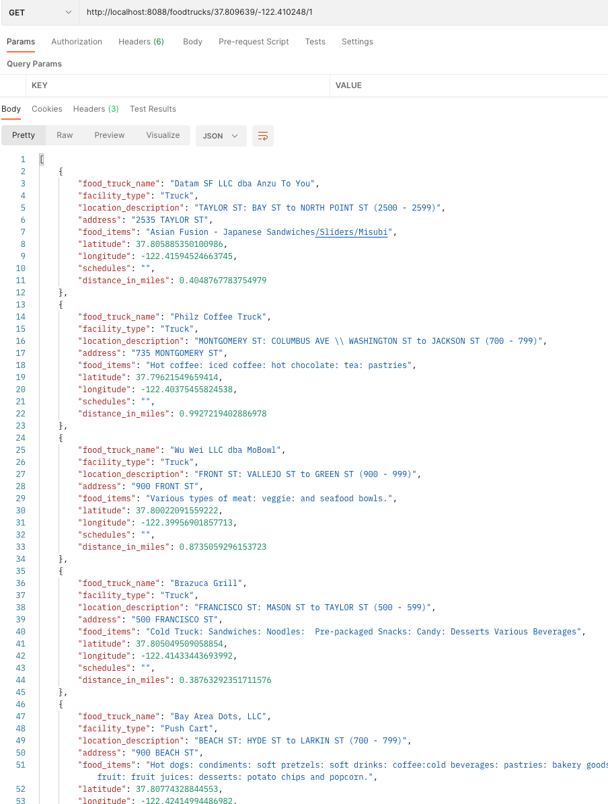

# Food Truck Service

Food Truck Service serves the list of Food Truck for people in San Francisco area.  The service gets the data from San Fransciso's food truck open dataset.  Our Food Truck Service provides a better experience for people to find their favorite Food Truck.  Here are some of features that Food Truck Service provides:

* Proximity (similar like Yelp)
* Food Truck location (exact Latitude and Longitude)
* Food Truck list (from San Francisco's food truck open dataset)

## Proximity

Proximity provides the list of food trucks that are nearby the current location (latitude and longitude) given of the radius (in miles).  
The is the API:

``` text
GET /foodtrucks/:latitude/:longitude/:radius
```

Note to demonstrate this feature, I picked Pier 39 location.  I was hungry but I like to get something to eat from food truck instead of having meal in fancy restaurants and I want to walk to get there.  So I entered this parameter in our Food Truck Service

``` text
http://localhost:8088/foodtrucks/37.809639/-122.410248/1
```

where `37.809639/-122.410248` is the location of Pier 39 and `/1` is the radius in miles so I can find the food trucks in walking distance.  

Note that you can find the location of Pier 39 from this website [latlong.net](https://latlong.net) and type in *Pier 39, San Francisco*.  You can also find other places somewhere in San Francisco to test other nearby locations.

The current implementation is far to be considered as a scalable solution.  The effort here is to learn about [Haversine formula](https://en.wikipedia.org/wiki/Haversine_formula) and what do we need to scale the solution.

Haversine formula determines the distance between two locations.  Given of target radius, the Proximity service calculates all food trucks distance, every distance that is less than or equal to radius will be added into the list.  
It's not efficient as it needs to evaluate or calculate every food truck location, but since the list of collections is not big (~400 records), it is still reasonable for this implementation.  

For scaling, we can take the list food trucks and put it visually into a map.  The entire map can be divided into smaller grids to group locations into smaller sets.  Since each set has the perimeter, we can calculate which set that the location is located.  Therefore we only to query a few grids to find nearby places.  Based on a given location and radius, we can traverse neighboring grids and only query these grids to find nearby places.  But what would happen if one grid has a lot of places and those places are not uniformly distributed among grids?  
The problem can be solved if we can dynamically adjust our grid size so that whenever we have a grid with a lot places, we break it down to create smaller grids.
A solution like [QuadTree](https://en.wikipedia.org/wiki/Quadtree) data structure will help in that scenario. It's a tree where each node has four children: top left, top right, bottom left, and bottom right.
There are multiple ways to travel the nodes such as doing recursive from parent to child or more sophisticated approach.  This [document](https://www.merl.com/publications/docs/TR2002-41.pdf) provides a very good explanation of traversal methods.

## Food Truck location

This particular feature takes an exact location (latitude and longitude) and returns the detail of food truck.  
This is the API:

``` text
GET /foodtrucks/:latitude/:longitude
```

``` text
http://localhost:8088/foodtrucks/37.809639/-122.410248
```

The current implementation for the list of food truck locations is stored in a map or hashtable, with a key contains the concatenation of latitude and longitude.  This allows the time complexity for that search operation is O(1) which is very efficient.  As of now it's stored in memory, but for production ready, it should be stored in memory store such as Redis cache.  If knowing exact location is hard, why do we need this feature?  It does help to provide the detail of particular food truck location that's returned from the list returned from Proximity.  That way, the item of the list perhaps just contain name of food trucks, location, and the distance.

## Food Truck list

This feature is simply return all the list from [San Francisco's food truck open dataset](https://data.sfgov.org/api/views/rqzj-sfat/rows.csv) in CSV format.  
This is the API:

``` text
GET /foodtrucks
```

``` text
http://localhost:8088/foodtrucks
```

## Deployment

To build it, go to `cmd/api` folder, and execute `go build -o food-truck`.  
To run it, enter `./food-truck`

``` text
Welcome to Food Truck Service
    The service opens up port 8088 and provides the following endpoints:
    GET http://localhost:8088/foodtrucks/:latitude/:longitude/:radius (for Proximity)
    GET http://localhost:8088/foodtrucks/:latitude/:longitude (for exact location)
    GET http://localhost:8088/foodtrucks/ (for list of FoodTrucks)
```

Note there is known issues in Golang 1.18 Darwin (Mac) build.  
If you encounter this issue

``` text
../../gopath/pkg/mod/golang.org/x/sys@v0.0.0-20200116001909-b77594299b42/unix/zsyscall_darwin_amd64.go:28:3: 
//go:linkname must refer to declared function or variable
```

Please update golang.org/x/sys, by running the following command

``` text
go get -u golang.org/x/sys
```

More information can be found [here](https://stackoverflow.com/questions/71507321/go-1-18-build-error-on-mac-unix-syscall-darwin-1-13-go253-golinkname-mus)

## Data loader

Food Truck service is a read heavy operation.  To scale the system, the ideal system must have a separate data loader.  It could be a simple cron job which fetch San Francisco open dataset in a daily basis,
so it can capture a new business being added or an existing business being removed.  The cron job will then update the data storage.

## Artifacts

  
[San Francisco Food Truck Open Dataset](artifacts/Mobile_Food_Facility_Permit.csv)
